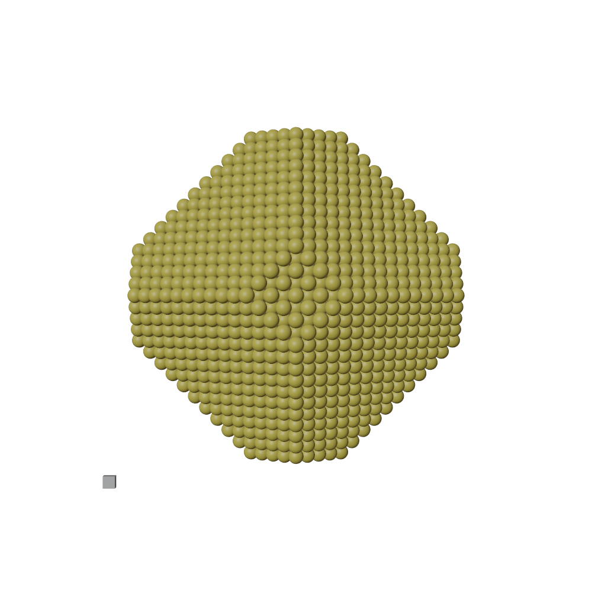

### Blase


Python module for drawing and rendering ASE (Atomic Simulation Environment) atoms and molecules objects using blender.

For the introduction of ASE , please visit https://wiki.fysik.dtu.dk/ase/index.html

* Support all file-formats using by ASE, including cif, xyz, cube, pdb, json, VASP-out and so on.
* Ball & stick
* Polyhedral
* Meta ball
* GUI
* GPU rendering and HPC jobs


### Panel added


### Author
* Xing Wang  <xingwang1991@gmail.com>

### Dependencies

* Python
* Blender
* ASE
* Skimage

### Installation

Clone this repo. Add it to your PYTHONPATH and PATH. On windows, you can edit the system environment variables.

``` sh
export PYTHONPATH=~/apps/blase:$PYTHONPATH
export PATH=~/apps/blase/bin:$PATH
export BLASE_PATH="~/apps/blase/"
```

You can specify the location of blender by ```sh export BLENDER_COMMAND="~/bin/blender" ```, otherwise blase will use the default blender command in the system.

#### Install ASE in Blender
* go to the python directory, e.g. ```blender-2.92.0/2.92/python/bin```
* install pip, ```./python3.7m -m ensurepip```
* install ase, ```./pip3 install --upgrade ase```
* install scikit-image, ```./pip3 install scikit-image```


### How to use
* Run from command line directly, supporting functions from build inside blase.  ```blase_gui h2o.xyz ```

* Run from python code directly, supporting functions from build inside blase.  ``` python examples/c2h6so.py ```


* Run from blender, supporting full functions from blender. ``` blender -b -P examples/b-c2h6so.py ```


### Examples

#### Draw molecule with bonds

A example of C<sub>2</sub>H<sub>6</sub>SO molecule. See examples/c2h6so.py

``` python
from ase.build import molecule
from runblase import write_blender

atoms = molecule('C2H6SO')
batoms = {'atoms': atoms, 'model_type': '1'}
blase = {'output_image': 'figs/c2h6so',}
write_blender(batoms, blase)
```


#### PDB file
A example to read atoms from exist PDB file. See examples/apt.py

```python
from ase.io import read, write
from runblase import write_blender

atoms = read('datas/ATP.pdb')
atoms.positions[:, 2] -= min(atoms.positions[:, 2]) - 2
camera_loc = atoms[3].position + [50, 0, 20]
batoms = {'atoms': atoms, 'model_type': '1'}
blase = {
          'engine': 'CYCLES', #'BLENDER_EEVEE', 'BLENDER_WORKBENCH', 'CYCLES'
          'camera_loc': camera_loc,  # distance from camera to front atom
          'camera_type': 'PERSP',  #  ['PERSP', 'ORTHO', 'PANO']
          'camera_lens': 100,  #
          'camera_target': atoms[3].position, #
          'functions': [['draw_plane', {'size': 1000, 'location': (0, 0, -1.0),  'color': [1.0, 1.0, 1.0, 1.0]}]],
          'output_image': 'figs/atp',
  }
write_blender(batoms, blase)
```


#### Draw isosurface for electron density

Read cube files, then draw atoms and isosurface. Here is a example of isosurface of H<sub>2</sub>O HOMO orbital.

``` python
from ase.io.cube import read_cube_data
from runblase import write_blender

data, atoms = read_cube_data('datas/h2o-homo.cube')
batoms = {'atoms': atoms,
          'model_type': '1',
          'show_unit_cell': True, 
          'isosurface': [data, -0.002, 0.002],
          }
blase = {
          'engine': 'BLENDER_WORKBENCH', #'BLENDER_EEVEE' #'BLENDER_WORKBENCH'
          'bbox': [[0, 10], [0, 10], [0, 10]], # set range for the box
          'output_image': 'figs/h2o-homo-cube',
          }
write_blender(batoms, blase)
````


#### Polyhedra
A example to draw polyhedra. See examples/tio2-polyhedra.py

```python
from ase.io import read
from runblase import write_blender

atoms = read('datas/tio2.cif')
batoms = {'atoms': atoms,
        'model_type': '2',
        'polyhedra_dict': {'Ti': ['O']},
        'color': 'VESTA',
        }
blase = {
          'output_image': 'figs/tio2-polyhedra',
  }
write_blender(batoms, blase)
```


#### Draw nanoparticle

Build nanoparticle using ASE, then draw the nanoparticle on a mirror. See examples/wulff.py

``` python
from ase.cluster import wulff_construction
from ase.visualize import view
from runblase import write_blender

surfaces = [(1, 1, 1), (1, 0, 0)]
energies = [1.28, 1.69]
atoms = wulff_construction('Au', surfaces, energies, 5000, 'fcc')
atoms.center(vacuum=2.0)
# view(atoms)
camera_loc =  atoms.get_center_of_mass() + [0, -300, 200]

batoms = {'atoms': atoms,
        'model_type': '0',
        'show_unit_cell': False,
        }
blase = {
          'engine': 'CYCLES', #'BLENDER_EEVEE', 'BLENDER_WORKBENCH', 'CYCLES'
          'camera_loc': camera_loc,  # distance from camera to front atom
          'camera_type': 'PERSP',  #  ['PERSP', 'ORTHO', 'PANO']
          'camera_lens': 100,  #
          'camera_target': atoms.get_center_of_mass(), #
          'functions': [['draw_plane', {'size': 1000, 'location': (0, 0, -1.0),  'color': [1.0, 1.0, 1.0, 1.0], 'material_style': 'mirror'}]],
          'output_image': 'figs/wulff',
  }
write_blender(batoms, blase, display = True)
````


#### Draw molecule on nanoparticle surface

A example of molecules adsorbed on nanoparticle.


#### Draw oxide monolayer on metal (111) surface


#### Animation
Cut stepped surface from ceria oxide

![]


#### Search molecule bonds out of unit cell
```python
from ase.io import read, write
from blase.tools import write_blender, get_polyhedra_kinds, get_bondpairs
atoms = read('anthraquinone.cif')
kwargs = {'show_unit_cell': 1, 
          'engine': 'BLENDER_WORKBENCH', #'BLENDER_EEVEE' #'BLENDER_WORKBENCH', CYCLES
          'radii': 0.6,
          'bond_cutoff': 1.0,
          'search_pbc': {'molecule_list':[['C', 'C'], ['C', 'O']]},
          'outfile': 'figs/test-search-molecule',
          }
write_blender(atoms, **kwargs)
```


#### Set different kind of atoms for the same element
````python
from ase.build import fcc111
from runblase import write_blender
#============================================================
atoms = fcc111('Pt', (7, 7, 3), vacuum=0.0)
kind_props = {
'Pt_0': {'color': [208/255.0, 208/255.0, 224/255.0]},
'Pt_1': {'color': [225/255.0, 128/255.0, 0/255.0]},
'Pt_2': {'color': [0/255.0, 191/255.0, 56/255.0]},
}
atoms.info['species'] = []
for i in range(len(atoms)):
     ind = int((atoms[i].x/5))
     kind = atoms[i].symbol + '_{0}'.format(ind)
     atoms.info['species'].append(kind)

camera_loc = atoms.get_center_of_mass() + [0, -60, 30]

batoms = {'atoms': atoms,
          'kind_props': kind_props,
          'model_type': '0',
          'color': 'VESTA',
        }
blase = {
          'engine': 'CYCLES',
          'camera_loc': camera_loc,  # distance from camera to front atom
          'camera_type': 'PERSP',  #  ['PERSP', 'ORTHO', 'PANO']
          'camera_lens': 100,  #
          'camera_target': atoms.get_center_of_mass(), #
          'output_image': 'figs/kinds',
  }
write_blender(batoms, blase)
````


#### Running on HPC using multi-process

Set up a bash file, and run the python script directly. 

```bash
#!/bin/bash -l
#SBATCH --nodes=1
#SBATCH --ntasks-per-node=36
#========================================

python h2o.py > blase.out
```

The performance is show below. The speed scales well with number of cpu.

| Number of CPU   |      Times (s) |
|----------|:-------------:|
| 1  |  512 |
| 12  |  24 |
| 36 |   15 |


#### Set materials type for atoms

Select materials type from ['blase', 'glass', 'ceramic', 'plastic'].

``` python
bobj.draw_atoms(material_type = 'blase')
````

Or set your own materials by setting the bsdf_inputs dict.

``` python
bsdf_inputs = {'Metallic': 1.0, 'Specular': 1.0, 'Roughness': 0.01, }
bobj.draw_atoms(bsdf_inputs = bsdf_inputs)
````


### Tips

#### Edit the studio light
The Workbench engine use the studio light instead of the lights in the scene. To make you image more brighter. You can add an new Studio light. https://docs.blender.org/manual/en/latest/editors/preferences/lights.html#prefs-lights-studio. Please save it to as ```StudioLight_blase.sl```. Then Blase will use this one when Workbench engined is used.


#### change rotation center of viewport to selected object.

https://blender.stackexchange.com/questions/179289/how-do-i-rotate-my-viewport-around-the-position-of-my-cursor


#### grid setting
https://www.katsbits.com/codex/grid/


### To do

* cut boundary for isosurface
* add panel to manipulate the atoms interactively
* add animation