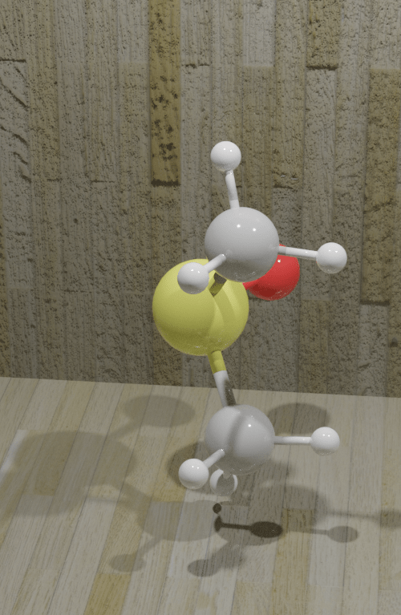

### Blase

Python module for drawing and rendering ASE (Atomic Simulation Environment) atoms and molecules objects using blender.

<pre> <b>Blase is not updated anymore!!!</b> 

Please go to Beautiful Atoms

https://beautiful-atoms.readthedocs.io/en/latest/

https://github.com/superstar54/beautiful-atoms

</pre>

