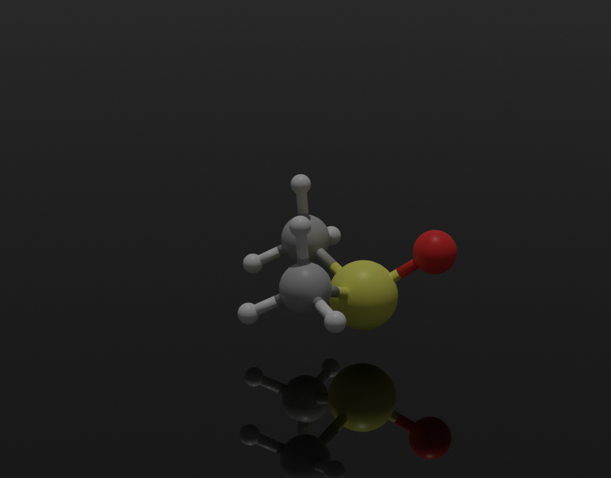
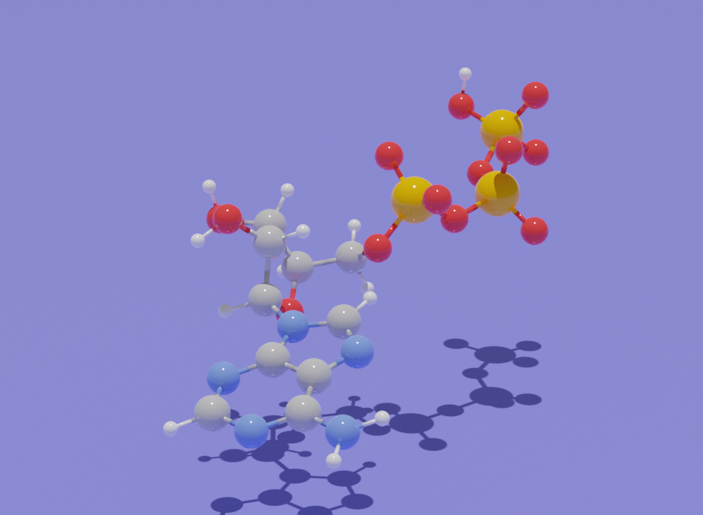
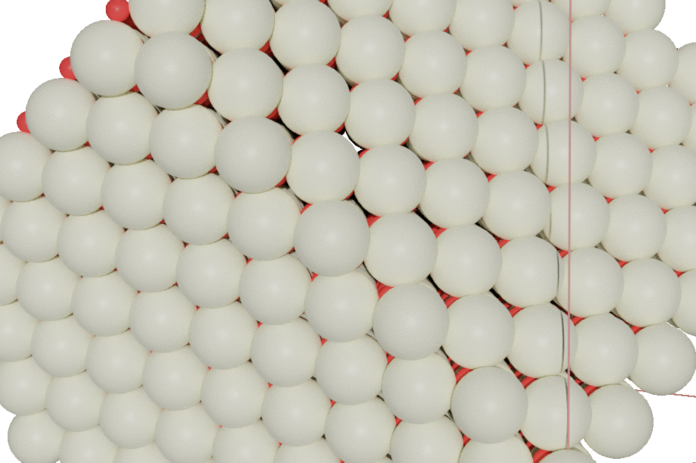
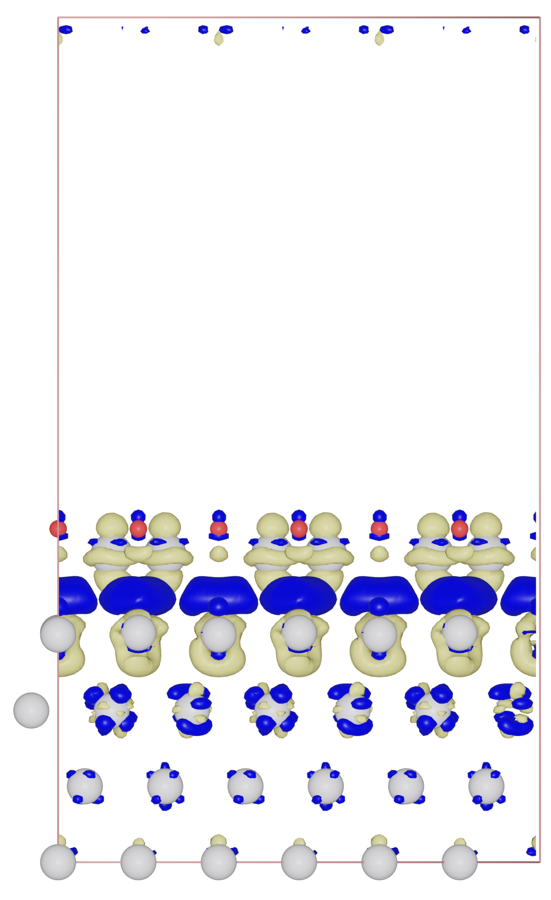
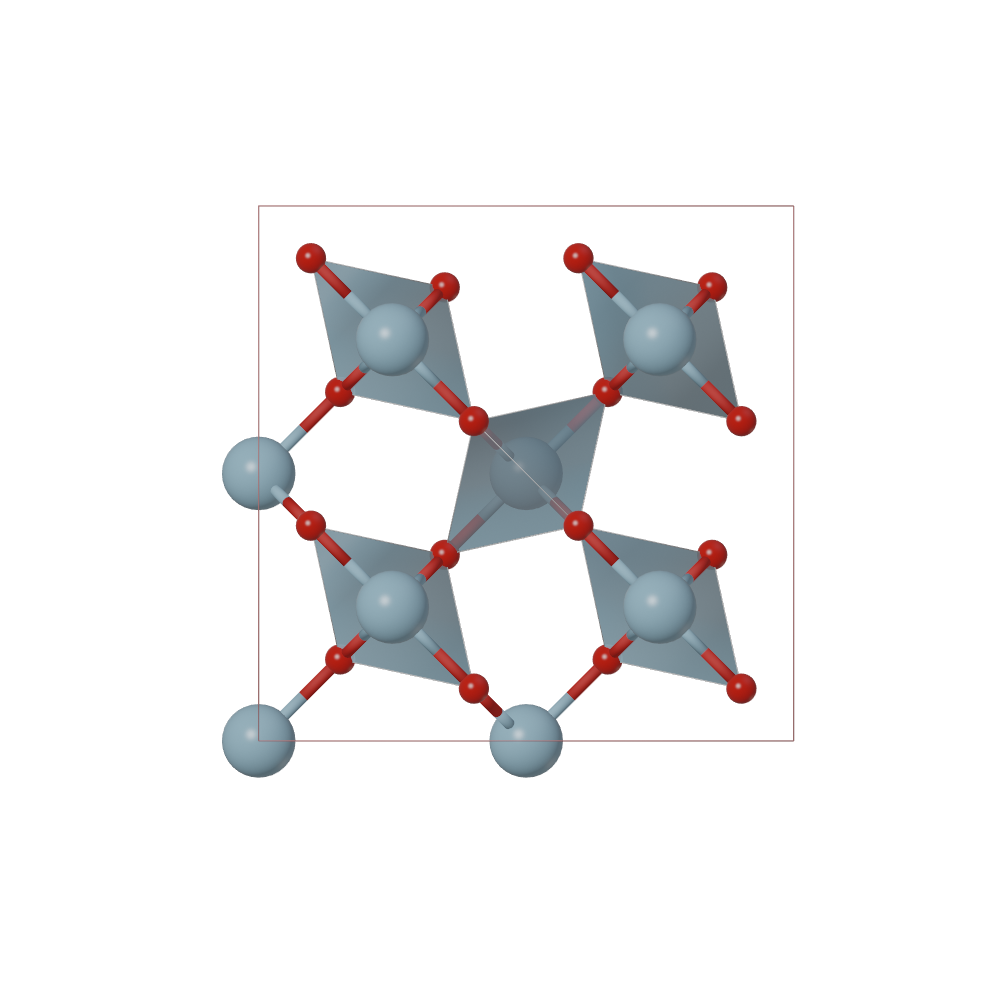
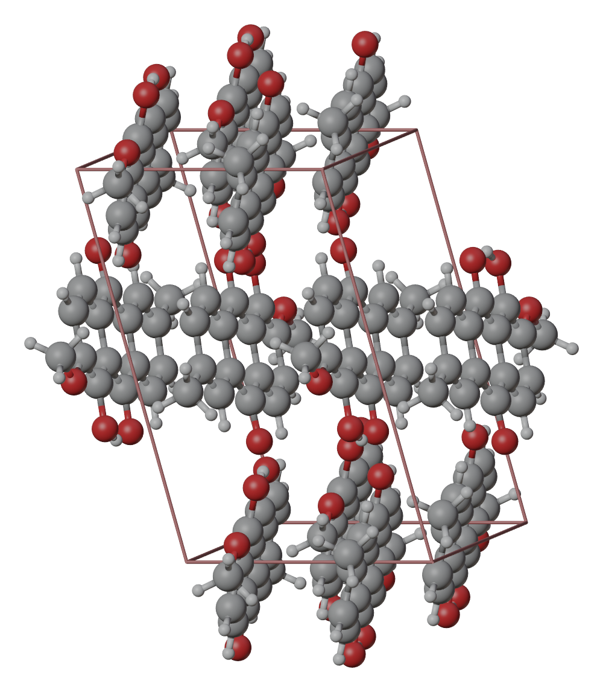
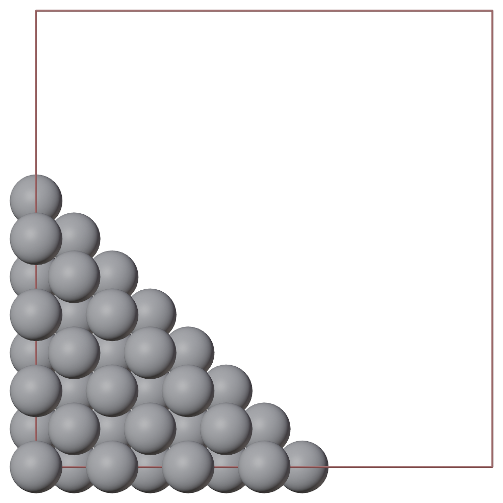
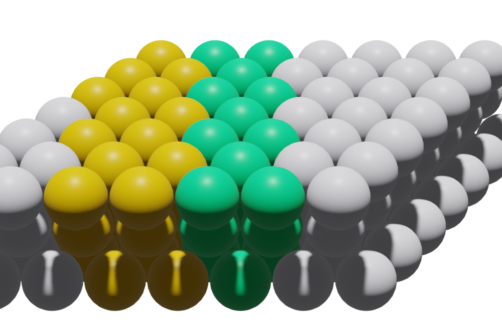

### Blase


Python module for drawing and rendering ASE (Atomic Simulation Environment) atoms and molecules objects using blender.

For the introduction of ASE , please visit https://wiki.fysik.dtu.dk/ase/index.html

* Support all file-formats using by ASE, including cif, xyz, cube, pdb, json, VASP-out and so on.
* Ball & stick
* Polyhedral
* Meta ball
* GPU rendering and HPC jobs


### Author
* Xing Wang  <xingwang1991@gmail.com>

### Dependencies

* Python
* Blender
* ASE
* Skimage

### Installation

Clone this repo. Add it to your PYTHONPATH and PATH. On windows, you can edit the system environment variables.

``` sh
export PYTHONPATH=~/apps/blase:$PYTHONPATH
export PATH=~/apps/blase/bin:$PATH
export BLASE_PATH="~/apps/blase/"
```

You can specify the location of blender by ```sh export BLENDER_COMMAND="~/bin/blender" ```, otherwise blase will use the default blender command in the system.

### How to use
* Run from command line directly, supporting functions from build inside blase.  ```blase_gui h2o.xyz ```

* Run from python code directly, supporting functions from build inside blase.  ``` python examples/c2h6so.py ```


* Run from blender, supporting full functions from blender. ``` blender -b -P examples/b-c2h6so.py ```


### Examples

#### Draw molecule with bonds

A example of C<sub>2</sub>H<sub>6</sub>SO molecule. See examples/c2h6so.py

``` python
from ase.build import molecule
from blase.tools import get_bondpairs, write_blender

atoms = molecule('C2H6SO')
atoms.center(vacuum  = 1.0)

camera_loc = atoms[3].position + [30, 0, 10]

kwargs = {'show_unit_cell': 0, 
          'engine': 'CYCLES', #'BLENDER_EEVEE' #'BLENDER_WORKBENCH'
          'camera_loc': camera_loc,  # distance from camera to front atom
          'camera_type': 'PERSP',  #  ['PERSP', 'ORTHO', 'PANO']
          'camera_lens': 100,  #
          'camera_target': atoms[3].position, #
          'ortho_scale': None, #
          'radii': 0.6, 
          'bonds': 'all',
        'functions': [['add_light', {'loc': [10, 0, 10], 'light_type': 'POINT'}],
                      ['draw_plane', {'size': 100, 'loc': (0, 0, -0.0), 'color': (0, 0, 0, 1.0), 'material_style': 'mirror'}]],
          'outfile': 'c2h6so-cycles'}
write_blender(atoms, **kwargs)
````




#### PDB file
A example to read atoms from exist PDB file.

```python
from ase.build import molecule
from ase.io import read
from blase.tools import get_bondpairs, write_blender

atoms = read('ATP.pdb')
atoms.positions[:, 2] -= min(atoms.positions[:, 2]) - 2
camera_loc = atoms[3].position + [50, 0, 20]

kwargs = {'show_unit_cell': 0, 
          'engine': 'CYCLES', #'BLENDER_EEVEE' #'BLENDER_WORKBENCH'
          'camera_loc': camera_loc,  # distance from camera to front atom
          'camera_type': 'PERSP',  #  ['PERSP', 'ORTHO', 'PANO']
          'camera_lens': 100,  #
          'camera_target': atoms[3].position, #
          'ortho_scale': None, #
          'radii': 0.6, 
          'bonds': 'all',
          'functions': [['draw_plane', {'size': 1000, 'loc': (0, 0, -1.0)}]],
          # 'resolution_x': 2000,
          'outfile': 'atp-cycles'}
write_blender(atoms, **kwargs)
```


#### Draw molecule on nanoparticle surface

A example of molecules adsorbed on nanoparticle.


#### Draw oxide monolayer on metal (111) surface


#### Animation
Cut stepped surface from ceria oxide

![]


#### Draw isosurface for electron density

Read cube files, then draw atoms and isosurface. Here is a example of isosurface of Pt/Ti<sub>2</sub>O<sub>3</sub> interface.

``` python
from ase.io.cube import read_cube_data
from blase.tools import write_blender

data, atoms = read_cube_data('test.cube')
kwargs = {'show_unit_cell': 1, 
          'radii': 0.4, 
          'functions': [['draw_isosurface', {'density_grid': data, 'cut_off': -0.002}],
                        ['draw_isosurface', {'density_grid': data, 'cut_off': 0.002, 'color': (0.0, 0.0, 1.0)}]],
          'rotations': [[90, '-x'], [30, 'y']],
          'outfile': 'testcube'}

write_blender(atoms, display=False, **kwargs)
````



#### Polyhedra
A example to draw polyhedra.

```python
from ase.io import read, write
from blase.tools import write_blender

atoms = read('tio2.cif')
kwargs = {'show_unit_cell': 1, 
          'engine': 'BLENDER_WORKBENCH',
          'radii': 0.6,
          'bond_cutoff': 1.0,
          'search_pbc': {'search_dict': {'Ti': ['O']}},
          'polyhedra_dict': {'Ti': ['O']},
          'outfile': 'figs/test-search-bonds',
          }
write_blender(atoms, **kwargs)

```



#### Search molecule bonds out of unit cell
```python
from ase.io import read, write
from blase.tools import write_blender, get_polyhedra_kinds, get_bondpairs
atoms = read('anthraquinone.cif')
kwargs = {'show_unit_cell': 1, 
          'engine': 'BLENDER_WORKBENCH', #'BLENDER_EEVEE' #'BLENDER_WORKBENCH', CYCLES
          'radii': 0.6,
          'bond_cutoff': 1.0,
          'search_pbc': {'molecule_list':[['C', 'C'], ['C', 'O']]},
          'outfile': 'figs/test-search-molecule',
          }
write_blender(atoms, **kwargs)
```


#### Cut surface
A example to cut (110) surface, with distance from origin to be d.
```python
from ase.build import bulk
from blase.tools import write_blender

atoms = bulk('Pt', cubic = True)
atoms = atoms*[6, 6, 6]

kwargs = {'show_unit_cell': 1, 
          'engine': 'BLENDER_WORKBENCH', #'BLENDER_EEVEE' #'BLENDER_WORKBENCH', CYCLES
          'radii': 1.0,
          # 'display': True,
          'boundary_list': [{'d': 10.0, 'index': [1, 1, 0]}],
          'outfile': 'figs/test-boundary',
          }
write_blender(atoms, **kwargs)
```



#### Set different kind of atoms for the same element
````python
#!/usr/bin/env python
from ase.build import surface, fcc111
from ase.visualize import view
from blase.tools import get_bondpairs, write_blender
#============================================================
atoms = fcc111('Pt', (7, 7, 3), vacuum=0.0)
kinds = []
kind_props = {
'Pt_0': {'color': [208/255.0, 208/255.0, 224/255.0]},
'Pt_1': {'color': [225/255.0, 128/255.0, 0/255.0]},
'Pt_2': {'color': [0/255.0, 191/255.0, 56/255.0]},
}
for i in range(len(atoms)):
     ind = int((atoms[i].x/5))
     kind = atoms[i].symbol + '_{0}'.format(ind)
     kinds.append(kind)
atoms.kinds = kinds

camera_loc = atoms.get_center_of_mass() + [0, -60, 30]

kwargs = {'show_unit_cell': 0, 
          'camera_loc': camera_loc,  # distance from camera to front atom
          'camera_type': 'PERSP',  #  ['PERSP', 'ORTHO', 'PANO']
          'camera_lens': 100,  #
          'camera_target': atoms.get_center_of_mass(), #
          'ortho_scale': None, #
          'kind_props': kind_props,
          'resolution_x': 1000,
          'outfile': 'test-kinds',
          }
write_blender(atoms, **kwargs)
````



#### Running on HPC using multi-process

Set up a bash file, and run the python script directly. 

```bash
#!/bin/bash -l
#SBATCH --nodes=1
#SBATCH --ntasks-per-node=36
#========================================

python h2o.py > blase.out
```

The performance is show below. The speed scales well with number of cpu.

| Number of CPU   |      Times (s) |
|----------|:-------------:|
| 1  |  512 |
| 12  |  24 |
| 36 |   15 |


#### Set materials type for atoms

Select materials type from ['blase', 'glass', 'ceramic', 'plastic'].

``` python
bobj.draw_atoms(material_type = 'blase')
````

Or set your own materials by setting the bsdf_inputs dict.

``` python
bsdf_inputs = {'Metallic': 1.0, 'Specular': 1.0, 'Roughness': 0.01, }
bobj.draw_atoms(bsdf_inputs = bsdf_inputs)
````

### To do

* cut boundary for isosurface
* add panel to manipulate the atoms interactively
* add animation