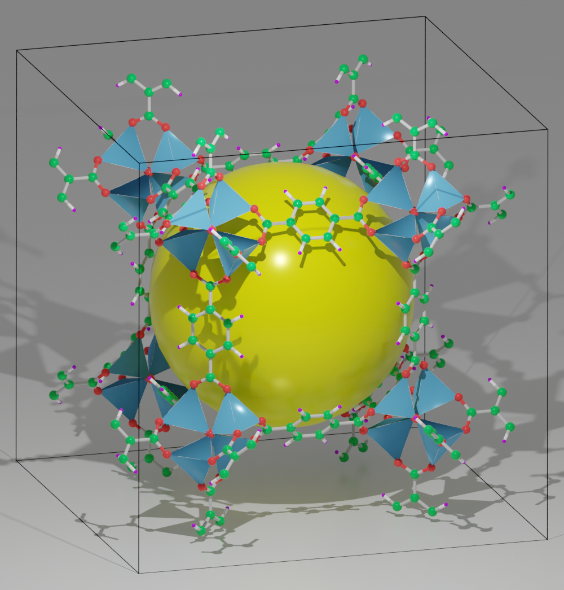
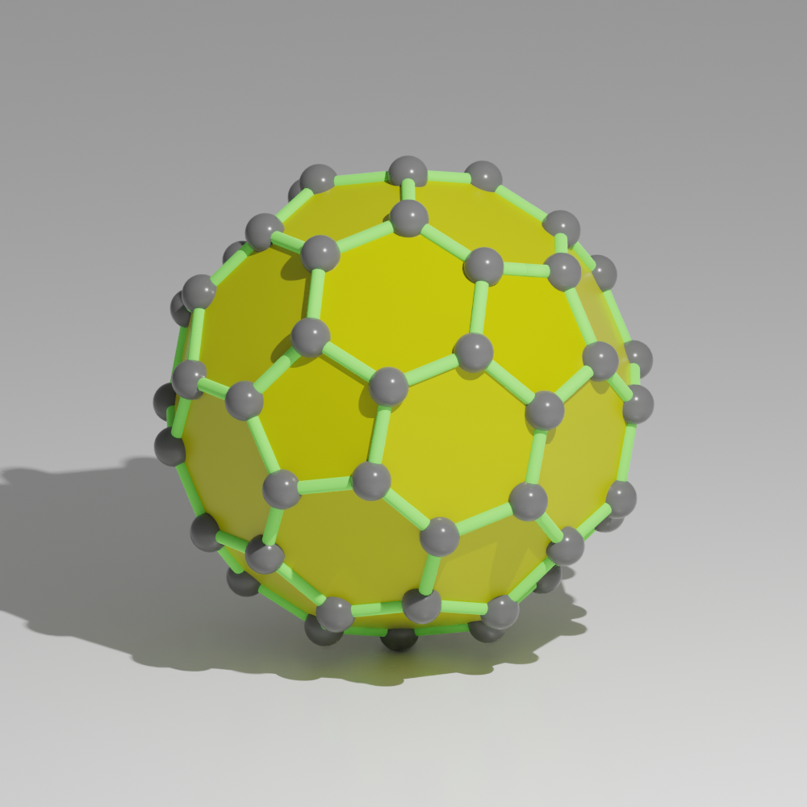

============================
Cavity
============================

sphere
-----------

The :meth:`~Batoms.draw_cavity_sphere` function is to draw a sphere to represent a cavity in porous materials. We find the cavity with a grid based algorithm. Here we search cavity with radius larger than 9.0 in the MOF-5 crystal.

>>> from ase.io import read
>>> from blase.batoms import Batoms
>>> from blase.bdraw import draw_plane
>>> atoms = read('docs/source/_static/datas/mof-5.cif')
>>> mof = Batoms(label = 'mof-5', atoms = atoms)
>>> mof['H'].color = [0.6, 0, 1.0, 1.0]
>>> mof['C'].color = [0.0, 0.6, 0.1, 1.0]
>>> mof.polyhedrasetting['Zn'].color = [0.1, 0.4, 0.7, 1.0]
>>> mof.model_type = 2
>>> mof.draw_cavity_sphere(9.0, boundary = [[0.2, 0.8], [0.2, 0.8], [0.2, 0.8]])

Polyhedral model
-----------------
In order to represent the cavity by a polyhedral model, we add a ghost site (species ``X``) at the center of a cavity. Then set the bond between ``X`` and atoms at the corners of the cage by ``bondsetting``.

>>> from ase.build import molecule
>>> from blase.batoms import Batoms
>>> from blase.bdraw import draw_plane
>>> c60 = molecule('C60')
>>> pos = c60.get_center_of_mass()
>>> c60 = Batoms(label = 'c60', atoms = c60)
>>> c60['C'].color = [0.1, 0.1, 0.1, 1.0]
>>> c60.bondsetting['C-C'].color1 = [0.2, 0.8, 0.1, 1.0]
>>> c60.bondsetting['C-C'].type = '0'
>>> # we add a ghost site (species ``X``) at the center of a cavity
>>> x = Batoms('x', {'X':[pos]})
>>> c60 = c60 + x
>>> # add bond `X-C`, and set polyhedra to True
>>> c60.bondsetting['X-C'] = [0, 10, 2, True]
>>> c60.polyhedrasetting['X'].color = [0.4, 0.4, 0, 1.0]
>>> c60.model_type = 1
>>> # draw polyhedral model manually and not show the edge
>>> c60.draw_polyhedras(show_edge = False)

