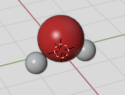

.. module:: blase.batom

===================
The Batom object
===================

The :class:`Batom` object is a object for one species. Here is how to define a ``H`` species with two atoms and ``O`` species with one atoms.

>>> from blase.batom import Batom
>>> h = Batom(label = 'h2o', species = 'H', positions = [[0, -0.76, -0.2], [0, 0.76, -0.2]])
>>> o = Batom(label = 'h2o', species = 'O', positions = [[0, 0, 0.40]])

Here, the ``label`` keywords to specify the name, and ``species`` keywords 
to specify the species ``H``, and the ``positions`` keywords to 
specify their positions of the H atoms. Other possible keywords are: ``element``, ``scale``, ``kind_props``, ``color_style``,
``material_style``, ``bsdf_inputs`` and ``draw``.

One get the positions of all ``H`` atoms by:

>>> h.positions

One set the positions of all ``H`` atoms by:

>>> new_positions = [[2, 0, 0], [4, 0, 0]]
>>> h.positions = new_positions

One set scale by:

>>> h.scale = 2

Other methods
=============

* :meth:`~Batom.translate`
  
For example, move all ``H`` species by a vector [0, 0, 5],

>>> h.translate([0, 0, 5])

* :meth:`~Batom.rotate`

For example, rotate ``H`` species 90 degree around 'Z' axis:

>>> h.rotate(90, 'Z')

* :meth:`~Batom.copy`
  
For example, copy ``H`` species:
        
>>> h_new = h.copy('h_new', 'H')

* :meth:`~Batom.delete`

For example, delete the second and the third atom in ``H`` species. Please note that index start from 0.

>>> h.delete([0, 1])

Or,

>>> del h[[0, 1]]

* :meth:`~Batom.repeat`

>>> from blase.batom import Batom
>>> c = Batom('co', 'C', [[0, 0, 0], [1.2, 0, 0]])
>>> c.repeat([3, 3, 3], np.array([[5, 0, 0], [0, 5, 0], [0, 0, 5]]))

* :meth:`~Batom.extend`

>>> from blase.batoms import Batom
>>> h1 = Batom('h2o', 'H_1', [[0, 0, 0]])
>>> h2 = Batom('h2o', 'H_2', [[0, 0, 2]])
>>> h1.extend(h2)

or,

>>> h = h1 + h2

List of all Methods
===================

.. autoclass:: Batom
   :members: