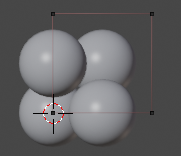
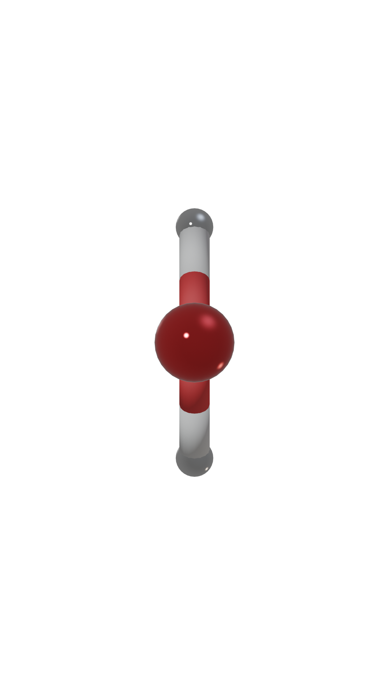

.. module:: blase.batoms

===================
The Batoms object
===================

The :class:`Batoms` object is a collection of Batom objects. Here is how to define a H2O molecule:

>>> from blase import Batoms
>>> h2o = Batoms({'O': [[0, 0, 0.40]], 'H': [[0, -0.76, -0.2], [0, 0.76, -0.2]]})

.. image:: _static/batoms-h2o.png
   :width: 3cm

Here, the argument specifies the type of the atoms and their positions. Other
possible keywords are: ``pbc``, ``cell``, ``atoms``, ``model_type``, ``boundary``, ``show_unit_cell``, ``isosurface``, ``kind_props``,
``color``, ``add_bonds``, ``remove_bonds`` and ``draw``.

Here is how you could define an platinum crystal structure with a lattice constant of 3.96 Å:

>>> from blase import Batoms
>>> a = 3.96
>>> positions = [[0, 0, 0], [a/2, a/2, 0], [a/2, 0, a/2], [0, a/2, a/2]]
>>> pt = Batoms({'Pt': positions}, pbc = True, cell = (a, a, a))

We can also use an ``Atoms`` object from ``ASE``. 

>>> from ase.build import molecule
>>> from blase.batoms import Batoms
>>> atoms = molecule('H2O')
>>> h2o = Batoms(atoms = atoms, label = 'h2o', model_type = '1')
>>> h2o.draw()
>>> h2o.render()

.. image:: _static/h2o.png
   :width: 3cm

Here, the first keyword ``atoms`` specifies the ase ``Atoms`` object, and we used
the ``model_type`` keyword to specify model type.

We can also read an structure from a file:

>>> from blase.bio import read
>>> tio2 = read('docs/source/_static/datas/tio2.cif')

One get and set ``model_type``, ``pbc``, ``show_unit_cell``, ``cell`` and ``boundary`` by:

>>> h2o.model_type = 0
>>> h2o.pbc = True
>>> h2o.cell = [[3, 0, 0], [0, 3, 0], [0, 0, 3]]
>>> h2o.show_unit_cell = False

model_type
===================

Here, four models can be set:

- 0: Space-filling

- 1: Ball-and-stick

- 2: Polyhedral

- 3: Stick

>>> h2o = Batoms(atoms = atoms, model_type = '1')

or,

>>> h2o.model_type = '1'

materials_style
===================

Set materials style for atoms. Select materials style from ['blase', 'glass', 'ceramic', 'plastic', 'mirror'].

>>> h2o = Batoms(atoms = atoms, label = 'h2o', model_type = '1', material_style = 'mirror')

Or set your own materials by setting the bsdf_inputs dict.

>>> bsdf_inputs = {'Metallic': 1.0, 'Specular': 1.0, 'Roughness': 0.01, }
>>> h2o = Batoms(atoms = atoms, label = 'h2o', model_type = '1', bsdf_inputs = bsdf_inputs)

Other methods
=============

* :meth:`~Batoms.translate`

For example, move h2o molecule by a vector [0, 0, 5],

>>> h2o.translate([0, 0, 5])

* :meth:`~Batoms.rotate`

For example, rotate h2o molecule 90 degree around 'Z' axis:

>>> h2o.rotate(90, 'Z')

* :meth:`~Batoms.copy`
  
For example, copy h2o molecule:
        
>>> h2o_new = h2o.copy(label = 'h2o_new')

* :meth:`~Batoms.delete`

For example, delete the second atom in h2o molecule. Please note that index start from 0.

>>> h2o.delete('H', [1])

Or,

>>> h2o['H'].delete([1])

* :meth:`~Batoms.replace`

For example, replace the all H in h2o molecule by S.

>>> h2o.replace('H', 'S', [1])

* :meth:`~Batoms.repeat`

>>> from ase.build import bulk
>>> from blase.batoms import Batoms
>>> au = bulk('Au', cubic = True)
>>> au = Batoms(atoms = au)
>>> au.draw()
>>> au.repeat([2, 2, 2])

* :meth:`~Batoms.extend`

>>> from ase.build import molecule, fcc111
>>> from blase.batoms import Batoms
>>> import numpy as np
>>> co = molecule('CO')
>>> co = Batoms(label = 'co', atoms = co)
>>> au = fcc111('Au', (5, 5, 4), vacuum=5.0)
>>> au = Batoms(label = 'au', atoms = au)
>>> co.translate(au.atoms[-1].position + np.array([0, 0, 2]))
>>> au.extend(co)

or,

>>> au = au + co

* :meth:`~Batoms.set_boundary`

Set boundary

>>> from blase.batoms import Batoms
>>> from ase.io import read
>>> atoms = read('docs/source/_static/datas/tio2.cif')
>>> tio2 = Batoms(label = 'tio2', atoms = atoms, model_type = '2', polyhedra_dict = {'Ti': ['O']}, color_style="VESTA")
>>> tio2.boundary = 0.5

* :meth:`~Batoms.write`

Save atoms to file, please vist write method in ASE, https://wiki.fysik.dtu.dk/ase/ase/io/io.html?highlight=write#ase.io.write

>>> au.write('au111-co.cif')

* :meth:`~Batoms.get_distances`

>>> h2o.get_distances('O', 0, 'H', [0, 1])

* :meth:`~Batoms.get_angle`

>>> h2o.get_angle('H', 0, 'O', 0, 'H', 1)

>>> au.show_index(index_type = 0)

* :meth:`~Batoms.show_index`

Show the index of atoms. Please change to ``Edit`` mode.

>>> au.show_index(index_type = 0)

* :meth:`~Batoms.render`

Render the atoms, and save to a png image.

>>> h2o.render(resolution_x = 1000, output_image = 'h2o.png')

List of all Methods
===================

.. autoclass:: Batoms
   :members: