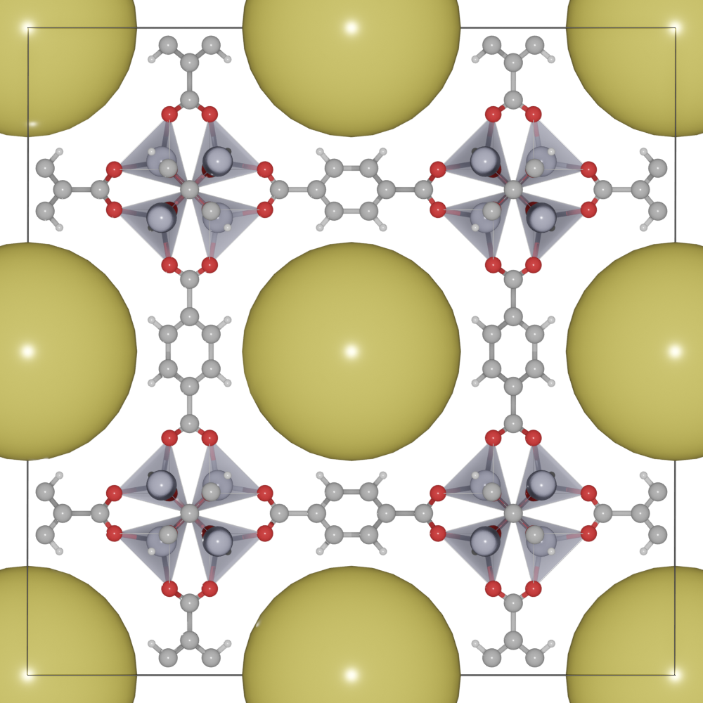

.. module:: blase.batoms

============================
Cavity
============================

The :meth:`~Batoms.draw_cavity` function is to draw cavity in porous materials. We find the cavity with a grid based algorithm. Here we search cavity with radius larger than 9.0 in the MOF-5 crystal.

>>> from ase.io import read
>>> from blase import Batoms
>>> atoms = read('docs/source/_static/datas/mof-5.cif')
>>> mof = Batoms(label = 'mof-5', atoms = atoms)
>>> mof.bondsetting[('Zn', 'O')] = [2.5, True, False]
>>> mof.bondsetting[('C', 'H')] = [1.4, False, False]
>>> mof.draw_cavity(9.0)
>>> mof.model_type = 2
>>> mof.render()

