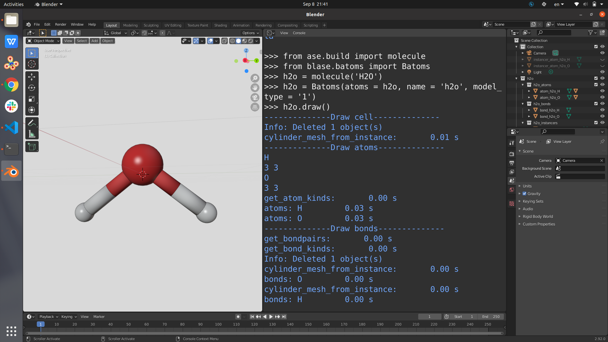
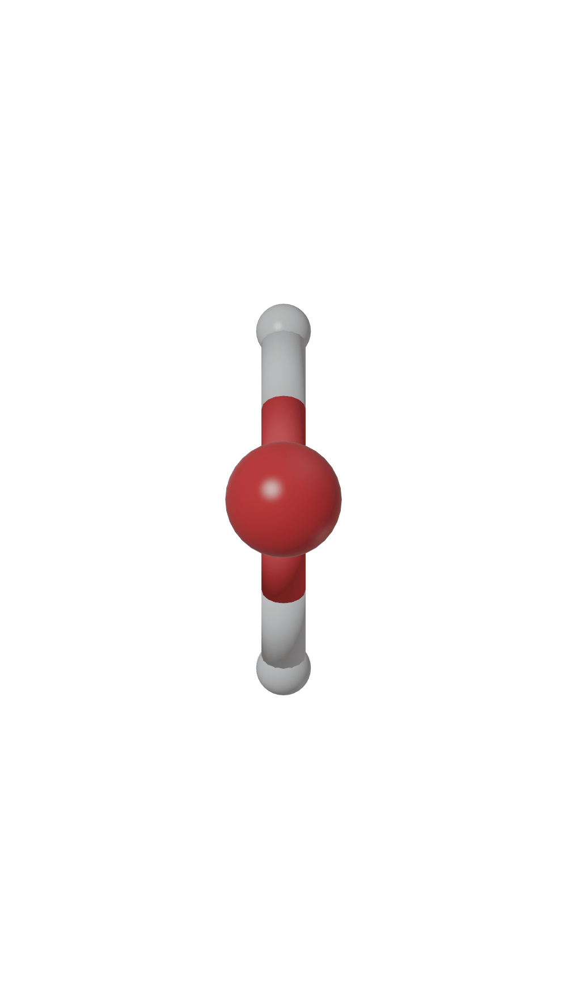

**********************
Getting Started
**********************

Inside Blender’s Python console
===========================================

Start Blender, and open a Python console, and run

>>> from ase.build import molecule
>>> from blase.batoms import Batoms
>>> atoms = molecule('H2O')
>>> h2o = Batoms(label = 'h2o', atoms = atoms)

|h2o-2|

Rendering the image

>>> h2o.render.run()

Use blaseio to run Blender in the background
==============================================

>>> from ase.build import molecule
>>> from blaseio import write_blender
>>> atoms = molecule('H2O')
>>> batoms = {'atoms': atoms, 'model_type': '1'}
>>> blase = {'output_image': 'figs/h2o',}
>>> write_blender(batoms, blase)

|h2o|

