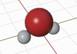

.. blase documentation master file, created by
   sphinx-quickstart on Wed Sep  8 10:33:04 2021.
   You can adapt this file completely to your liking, but it should at least
   contain the root `toctree` directive.

=================================
Welcome to blase's documentation!
=================================
Blase is a Python package for drawing and rendering atoms and molecules objects using blender.

>>> from blase.batoms import Batoms
>>> h2o = Batoms({'O': [[0, 0, 0.40]], 'H': [[0, -0.76, -0.2], [0, 0.76, -0.2]]})

|logo|

Support features:

* Model: space-filling, ball-stick, polyhedral, cavity
* File type: cif, xyz, cube, pdb, json, VASP-out and so on.
* Isosurface
* Animation
* GUI

.. toctree::
   :maxdepth: 3
   
   install
   getting-started
   tutorial
   module
   gui/index
   gallery
   tips
   faqs
   development

* :ref:`genindex`
* :ref:`modindex`
* :ref:`search`

.. _feedback: 
.. _affiliated packages: 

