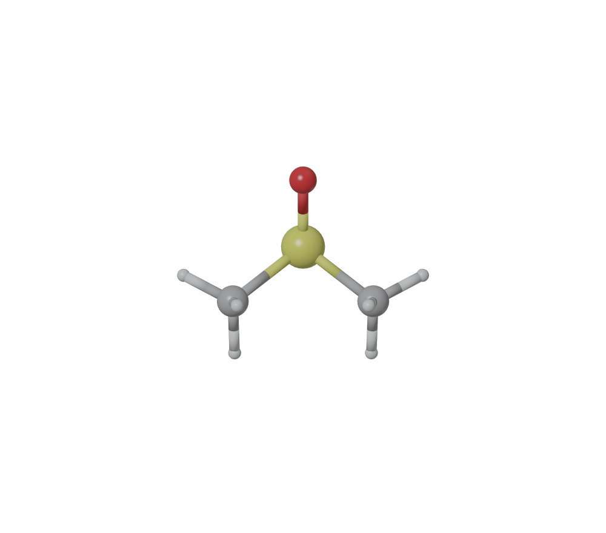

.. blase documentation master file, created by
   sphinx-quickstart on Wed Sep  8 10:33:04 2021.
   You can adapt this file completely to your liking, but it should at least
   contain the root `toctree` directive.

=================================
Welcome to blase's documentation!
=================================
Blase is a Python package for drawing and rendering ASE (Atomic Simulation Environment) atoms and molecules objects using blender.

>>> from ase.build import molecule
>>> from blaseio import write_blender
>>> atoms = molecule('C2H6SO')
>>> batoms = {'atoms': atoms, 'model_type': '1'}
>>> blase = {'output_image': 'figs/c2h6so',}
>>> write_blender(batoms, blase)

|logo|

.. toctree::
   :maxdepth: 3
   
   install
   getting-started
   tutorial
   module
   gui/index
   gallery
   tips
   development

* :ref:`genindex`
* :ref:`modindex`
* :ref:`search`

.. _feedback: 
.. _affiliated packages: 

