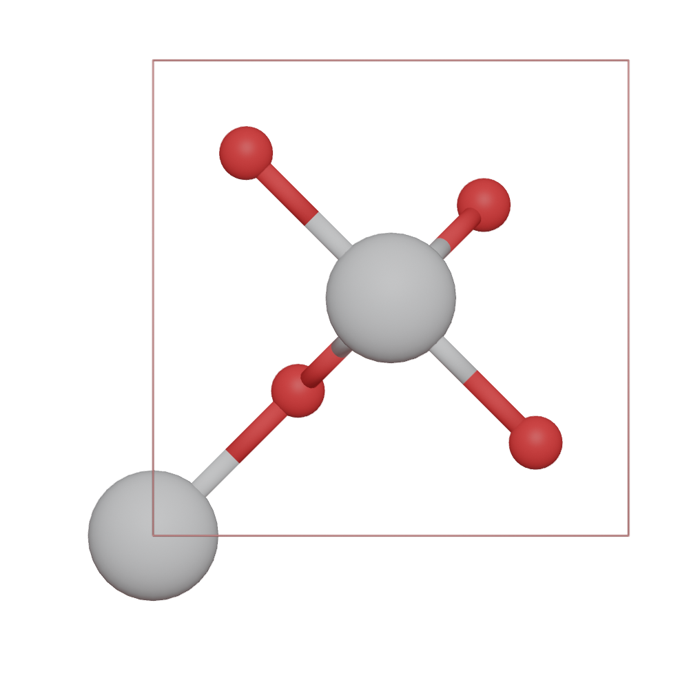
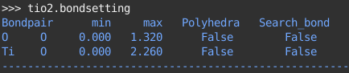
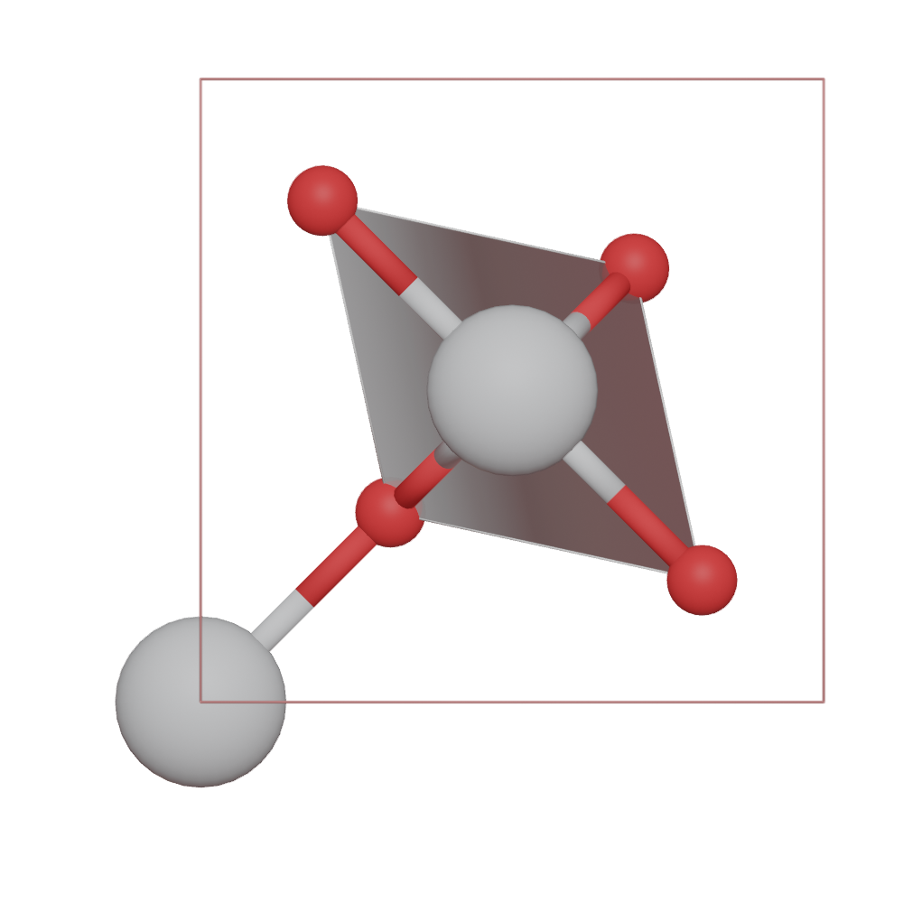
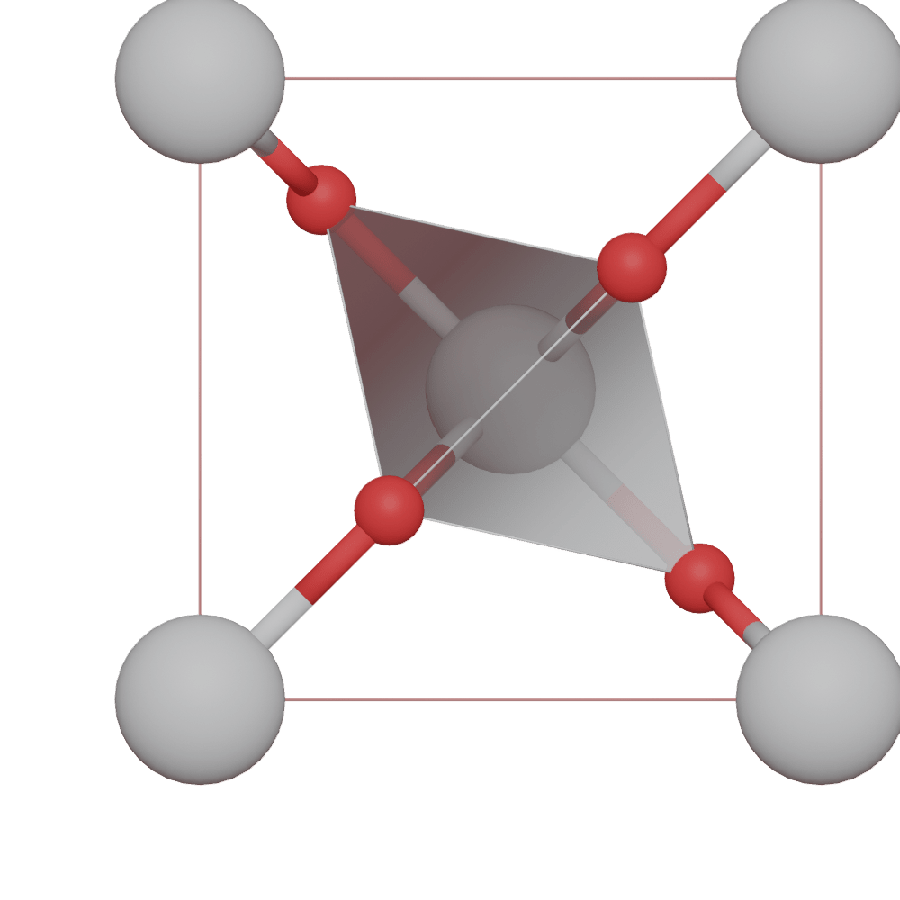
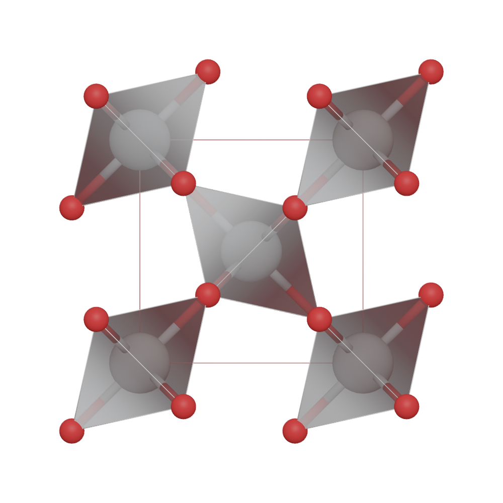

.. module:: blase.bondsetting

========================
The Bondsetting object
========================

By defaut, we use `ase.neighborlist.neighbor_list` to get the bond paris. We use default radius for every atoms, and if two spheres overlap, atoms are connected by a bond.

>>> from blase.bio import read
>>> tio2 = read('docs/source/_static/datas/tio2.cif')
>>> tio2.model_type = 1

You can print the default bondsetting by:

>>> tio2.bondsetting

To build up coordination polyhedra, the value for ``polyhedra`` should be set to ``True``. To change setting for a bond pair by:

>>> tio2.bondsetting[('Ti', 'O')] = [0.5, 2.5, True, False]
>>> tio2.model_type = 2

Search bond mode
==================
 
 * Do not search atoms beyond the boundary
  

>>> tio2.boundary = 0.01
>>> tio2.model_type = 2

* Search additional atoms if species1 is included in the boundary, the value for ``Search_bond`` should be set to ``True``. To change setting for a bond pair by:

>>> tio2.bondsetting[('Ti', 'O')] = [0.5, 2.5, True, True]
>>> tio2.update_boundary()
>>> tio2.model_type = 2

List of all Methods
===================

.. autoclass:: Bondsetting
   :members: