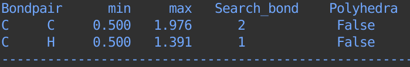
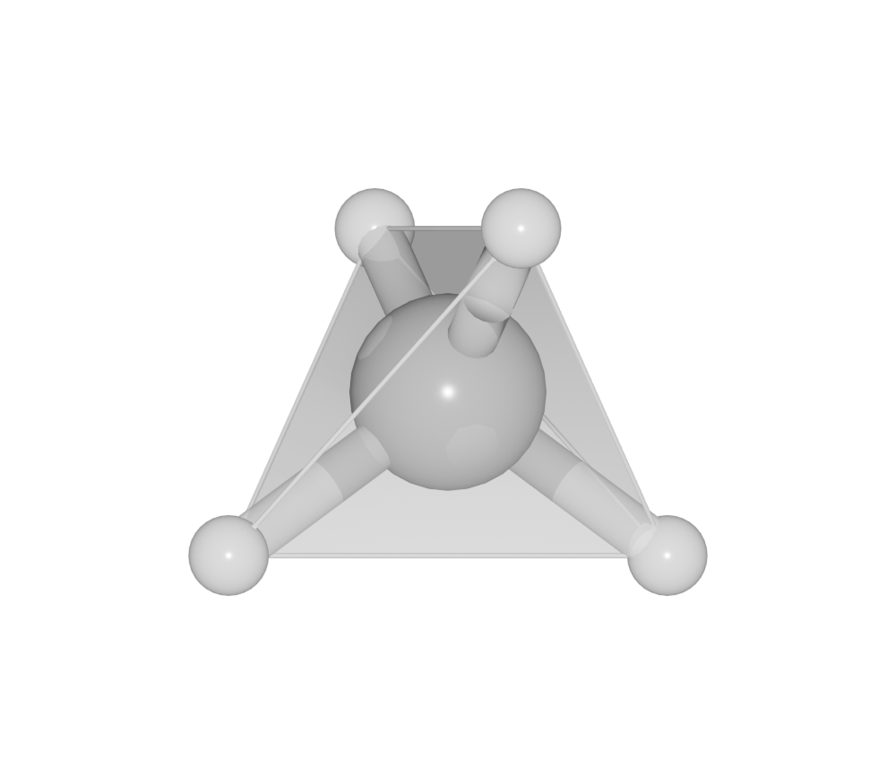
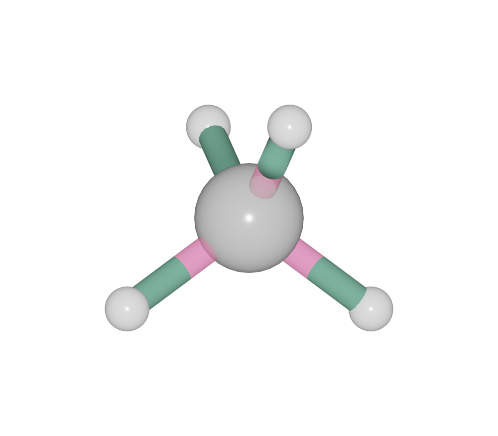

.. module:: blase.bondsetting

========================
The Bondsetting object
========================

The :class:`Bondsetting` object is used to store and set all parameters related with bonds. It is a collection of :class:`BlaseBond` object. It should always bind with a :class:`Batoms` object. Possible keywords are: ``symbol1``, ``symbol2``, ``min``, ``max``, ``search``, ``polyhedra``, ``color1``, ``color2`` and ``bondlinewidth``. 

>>> from ase.build import molecule
>>> from blase.batoms import Batoms
>>> ch4 = Batoms('ch4', atoms = molecule('CH4'))
>>> ch4.model_type = 2

You can print the default bondsetting by:

>>> ch4.bondsetting

By defaut, we use default radius (``ase.data.covalent_radii``) for every atoms, and the maximum bondlength is the sum of two radius and then scaled by a default cutoff (1.3). The minimum bondlength is 0.5.

Polyhedra
==================

One can change setting for a bond pair. For example, to build up coordination polyhedra, the value for ``polyhedra`` should be set to ``True``:

>>> ch4.bondsetting['C-H'].polyhedra = True
>>> ch4.model_type = 2

Search bond mode
==================
 
 - ``0``  Do not search atoms beyond the boundary
 - ``1``  Search additional atoms if species1 is included in the boundary

To change setting for ``Search_bond`` by:

>>> tio2.bondsetting['Ti-O'].polyhedra = True
>>> tio2.update_boundary()
>>> tio2.model_type = 2

.. image:: ../_static/bondsetting_tio2_2.png
   :width: 8cm

Color
==================

One can print the default color by:

>>> ch4.bondsetting['C-H'].color1[:]

One can change color for a bond pair. 

>>> ch4.bondsetting['C-H'].color1 = [0.8, 0.1, 0.3, 0.5]
>>> ch4.bondsetting['C-H'].color2 = [0.1, 0.3, 0.2, 1.0]
>>> ch4.model_type = 1

List of all Methods
===================

.. autoclass:: Bondsetting
   :members: