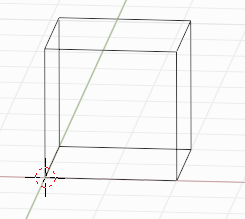
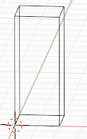
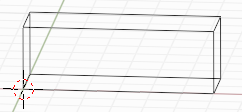

module:: blase.cell

===================
The Bcell object
===================

The :class:`Bcell` object is an object for unit cell. Here is how to cubic unit cell.

>>> from blase.cell import Bcell
>>> cell = Bcell(label = 'pt', array = [2, 2, 2])

Here, the ``label`` keyword to specify the name, and ``array`` keyword 
to specify the size. Other possible keyword are: ``location``.

Set the cell component:

>>> cell[2, 2] += 3

Other methods
=============
* :meth:`~Bcell.copy`
  
For example, copy cell:
        
>>> cell_new = cell.copy('pt_new')

* :meth:`~Bcell.repeat`

>>> from blase.cell import Bcell
>>> cell = Bcell(label = 'pt', array = [2, 2, 2])
>>> cell.repeat([3, 1, 1])

List of all Methods
===================

.. autoclass:: Bcell
   :members:
