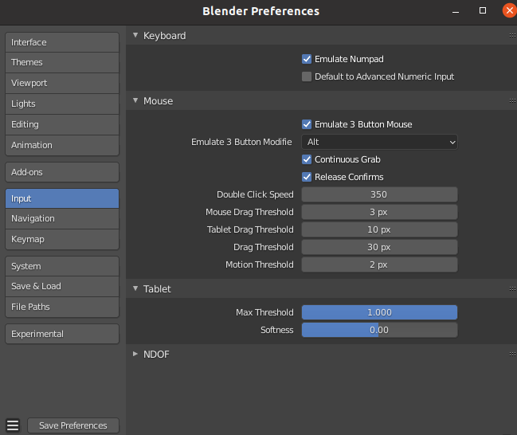
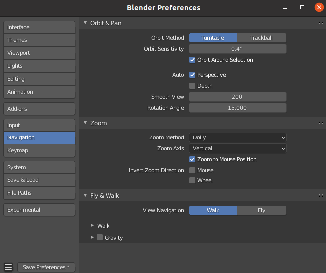

=======
Tips
=======

The following setting will make manipulating more easy, thus are strongly suggested.

3-button-mouse and Numpad
==========================
For laptop without mouse, open preference panel and select:

- Emulate Numpad
- Emulate 3 Button Mouse

After that, you can:

- To rotate the view, press Alt + Left Mouse button and drag.
- To pan the view, press Shift + Alt + Left Mouse button and drag.

Change rotation and zoom center of viewport to selected object
===============================================================

Open preference panel and select:

- Orbit Around Selection
- Zoom to Mouse Position

The following tips are optional.

Grid setting
=======================

https://www.katsbits.com/codex/grid/

you can deselect ``Grid`` and ``Floor``.

