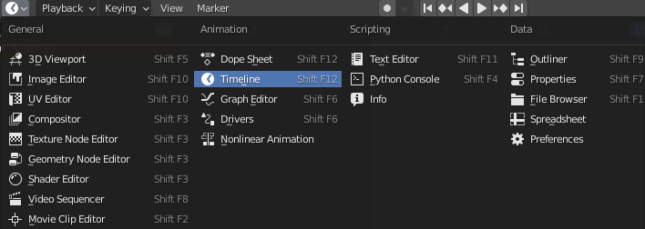

===================
Animation
===================

The function :meth:`~Batoms.load_frames` in :mod:`Batoms <blase.batoms>` object is used to load positions of atoms for animation.

Here, we rotate a molecule and save it to a list:

>>> from ase.build import molecule
>>> atoms = molecule('C2H6SO')
>>> images = []
>>> for i in range(20):
>>>     temp = atoms.copy()
>>>     temp.rotate(18*i, 'z', center = atoms[0].position)
>>>     images.append(temp)

Then load it to :meth:`~Batoms.load_frames`:

>>> from blase.batoms import Batoms
>>> c2h6so = Batoms(label = 'c2h6so', atoms = images)
>>> c2h6so.load_frames()

You can now play the animation using `Timeline` window in Blender. 

Or you can render all images by:

>>> c2h6so.render.run([0, 0, 1], engine = 'eevee', animation = True)

Then, on Linux, run following command to convert all png files to a gif file::

    convert -dispose Background *.png animation.gif

.. image:: ../_static/animation_c2h6so.gif
   :width: 8cm

You can also read the images from a trajectory file, such as an xyz file:

>>> from blase.bio import read
>>> images = read('c2h6so-animation.xyz', index = ':')

For ``Espresso`` output file:

>>> from blase.bio import read
>>> images = read('espresso.pwo', index = ':')

Animation only support model_type ``Space-filling``.

