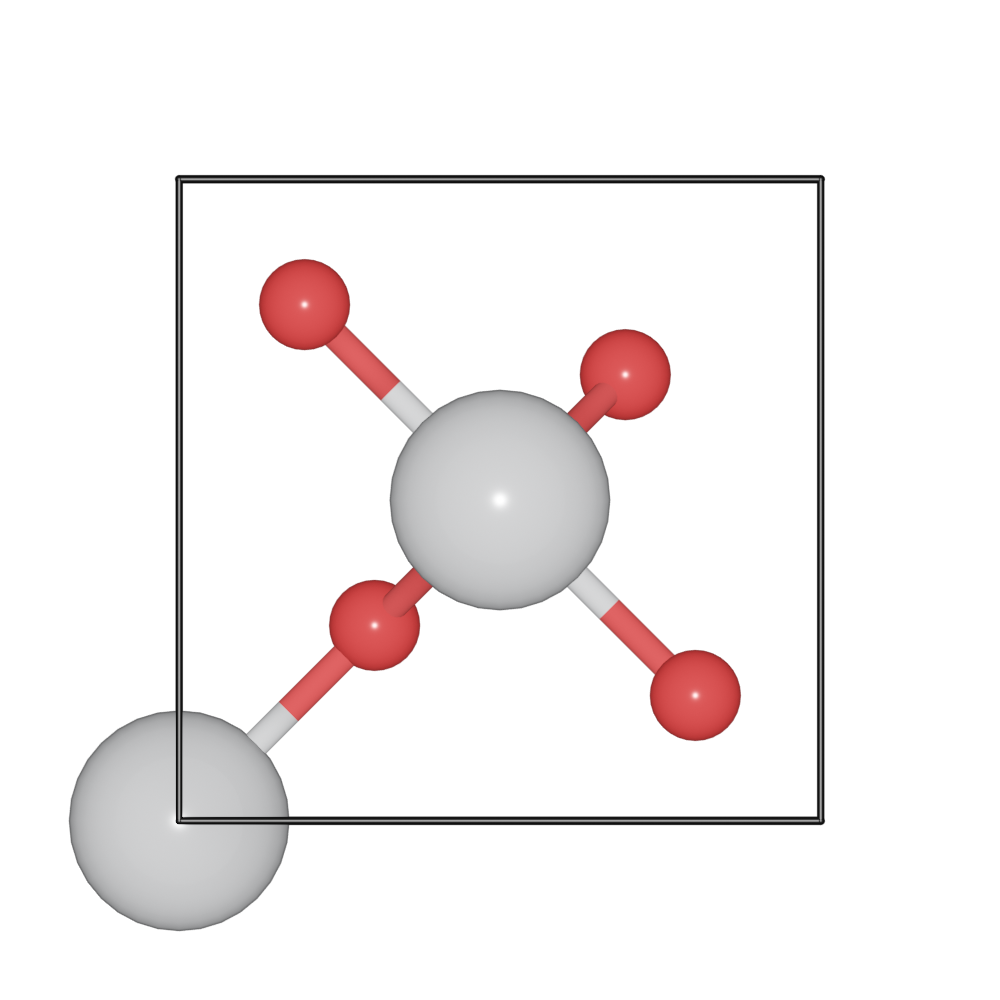
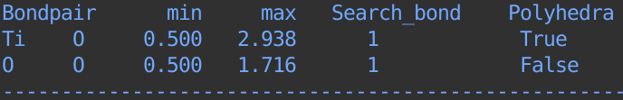
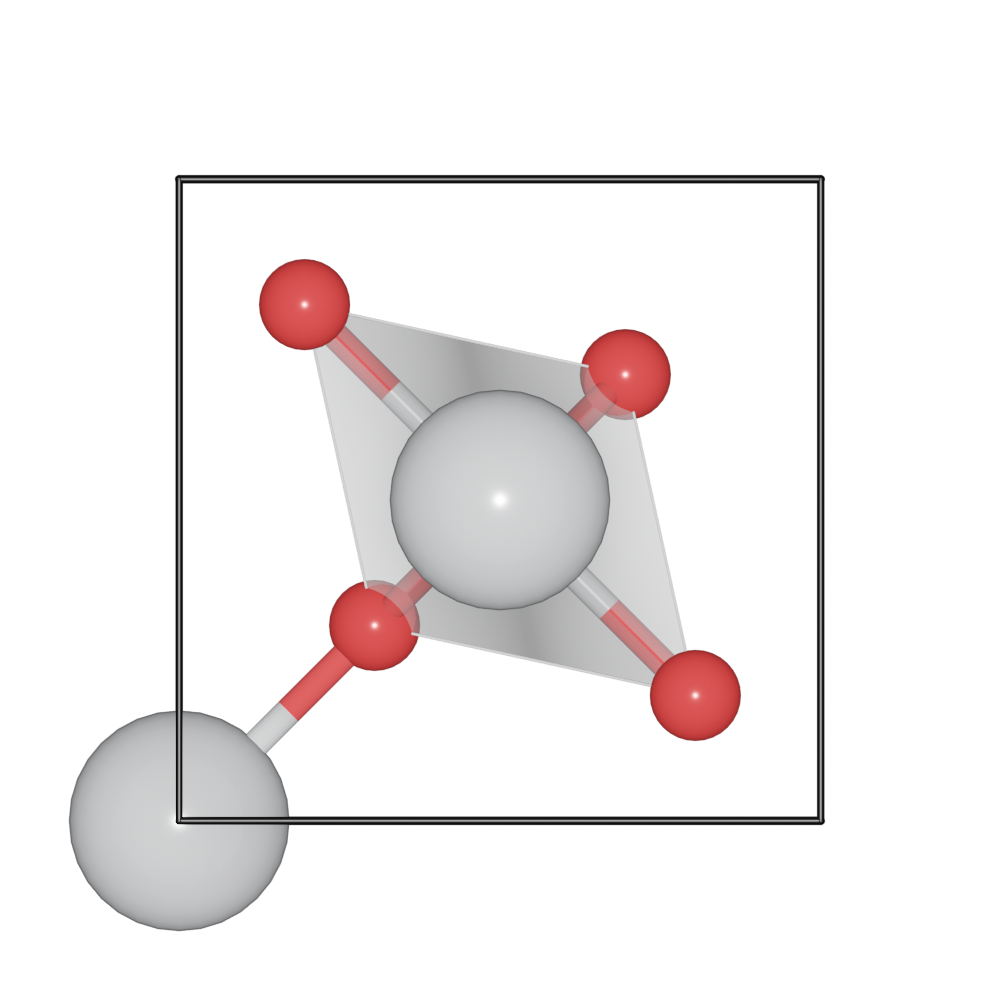
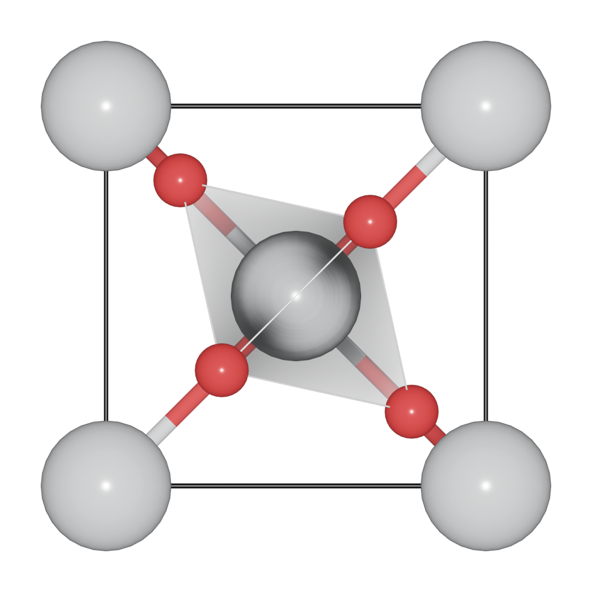

========================
Bond and Polyhedra
========================

The :mod:`Bondsetting <blase.bondsetting>` object controls various settings such as the bondlength and the polyhedra.
One can set ``model_type`` to draw the bond and polyhedra.

>>> from blase.bio import read
>>> tio2 = read('docs/source/_static/datas/tio2.cif')
>>> tio2.show_unit_cell = True
>>> tio2.model_type = 1

You can print the default bondsetting by:

>>> tio2.bondsetting

To build up coordination polyhedra, the value for ``polyhedra`` should be set to ``True``. To change setting for a bond pair by:

>>> tio2.bondsetting['Ti-O'].polyhedra = True
>>> tio2.model_type = 2

Search bond mode
==================

Search additional atoms if species1 is included in the boundary, the value for ``Search_bond`` should be set to `>0`. To change setting for a bond pair by.

>>> tio2.boundary = 0.01
>>> tio2.bondsetting['Ti-O'].search = 1
>>> tio2.model_type = 2

.. image:: ../_static/bondsetting_tio2_3.png
   :width: 8cm

Do not search atoms beyond the boundary. The value for ``Search_bond`` should be set to 0.  

>>> tio2.bondsetting['Ti-O'].search = 0
>>> tio2.update_boundary()
>>> tio2.model_type = 2

