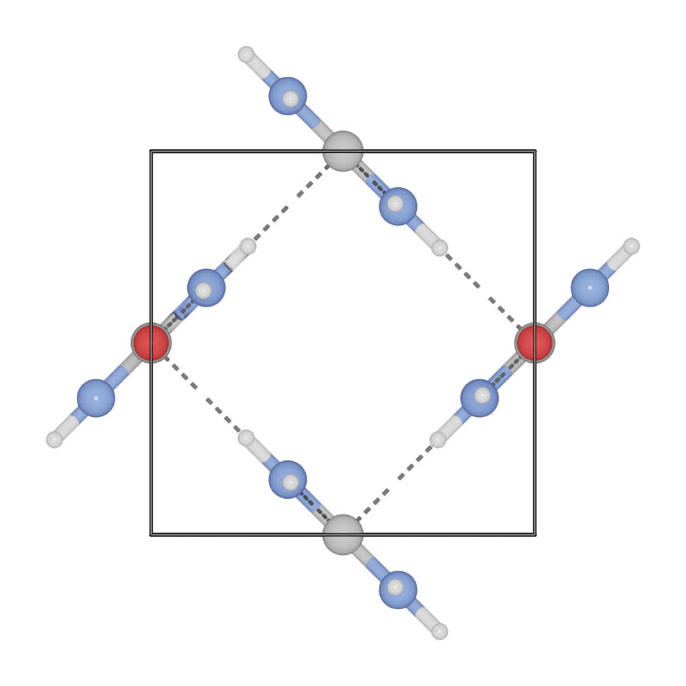

========================
Bond and Polyhedra
========================

The :mod:`Bondsetting <blase.bondsetting>` object controls various settings such as the bondlength and the polyhedra.
One can set ``model_type`` to draw the bond and polyhedra.

>>> from blase.bio import read
>>> tio2 = read('docs/source/_static/datas/tio2.cif')
>>> tio2.show_unit_cell = True
>>> tio2.model_type = 1

.. image:: ../_static/bond_tio2.png
   :width: 8cm

You can print the default bondsetting by:

>>> tio2.bondsetting

.. image:: ../_static/bondsetting_tio2.png
   :width: 15cm

To build up coordination polyhedra, the value for ``polyhedra`` should be set to ``True``. To change setting for a bond pair by:

>>> tio2.bondsetting['Ti-O'].polyhedra = True
>>> tio2.model_type = 2

.. image:: ../_static/bondsetting_tio2_1.png
   :width: 8cm

Search bond mode
==================

* Do not search atoms beyond the boundary. The value for ``Search_bond`` should be set to 0.  

>>> tio2.bondsetting['Ti-O'].search = 0
>>> tio2.update_boundary()
>>> tio2.model_type = 2

.. image:: ../_static/bondsetting_tio2_2.png
   :width: 8cm

* Search additional atoms if species1 is included in the boundary, the value for ``Search_bond`` should be set to `>0`. To change setting for a bond pair by.

>>> tio2.boundary = 0.01
>>> tio2.bondsetting['Ti-O'].search = 1
>>> tio2.model_type = 2

.. image:: ../_static/bondsetting_tio2_3.png
   :width: 8cm

* Search bonded atoms of species1 or species2 recursively. This mode is the used for searching molecules.

>>> from blase.bio import read
>>> mol = read('docs/source/_static/datas/urea.cif')
>>> mol.boundary = 0.01
>>> mol.draw_cell()
>>> mol.model_type = 1
>>> mol.render.run([1, -0.3, 0.1], engine = 'eevee', output = 'bondsetting_search_bond_molecule.png')

Hydrogen bond
===================

To build up hydrogen bond for ``X-H -- Y``. Set the minimum and maximum distances of ``H-Y``, and set the ``bondlinewdith`` to a small value. Such as ``H-O`` and ``H-N`` bond.

>>> from ase.build import molecule
>>> from blase.batoms import Batoms
>>> h2o = molecule('H2O')
>>> h2o2 = molecule('H2O')
>>> h2o2.rotate(90, 'x')
>>> h2o2.translate([0, 0, 3])
>>> h2o = h2o + h2o2
>>> h2o = Batoms(label = 'h2o', atoms = h2o)
>>> h2o.bondsetting['H-O'].min = 2.0
>>> h2o.bondsetting['H-O'].max = 3.0
>>> h2o.bondsetting['H-O'].bondlinewidth = 0.01
>>> h2o.bondsetting['H-O'].style = '1'
>>> h2o.model_type = 1
>>> h2o.render.run([1, 0 ,0], engine = 'eevee', output = 'hydrogen-bond.png')

.. image:: ../_static/hydrogen-bond.png
   :width: 5cm

