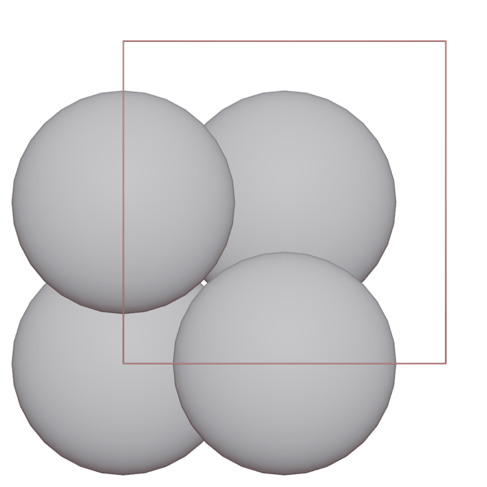
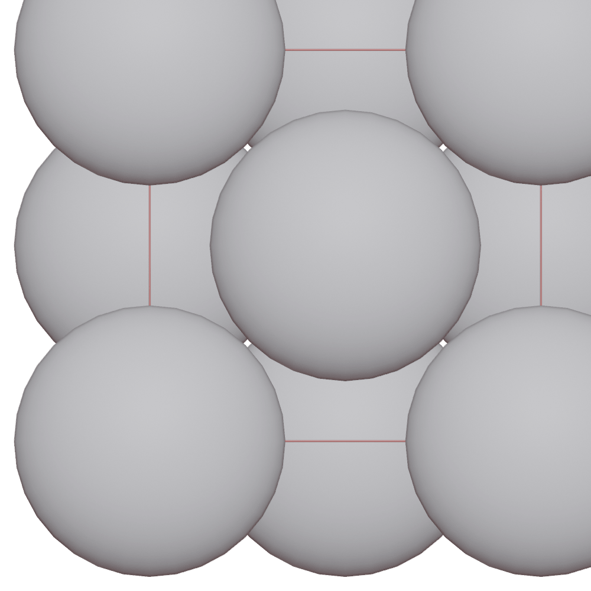
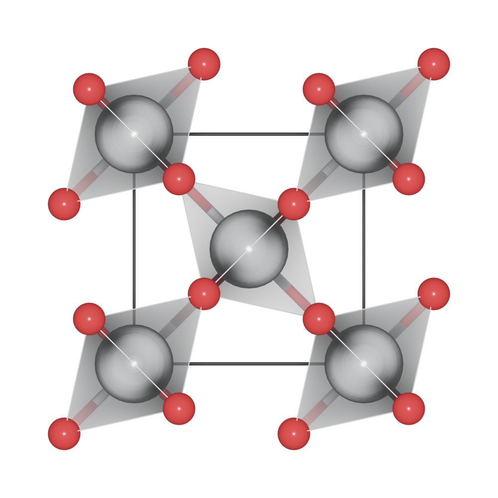

===================
Boundary mode
===================

The `boundary` key in `Batoms` is used to search atoms near the boundary of the cell. The default value is [0, 0, 0], thus no atoms outside the cell will be search.

>>> from ase.build import bulk
>>> from blase.batoms import Batoms
>>> pt = bulk('Pt', cubic = True)
>>> pt = Batoms(label = 'pt', atoms = pt)
>>> pt.render()

Then we change boundary to [0.02, 0.02, 0.02]:

>>> pt.boundary = [0.02, 0.02, 0.02]
>>> pt.render()

In this case, atoms in the range of [-0.02, 1.02] of the unit cell will be searched. Because `pt` is periodic, so we get more Pt atoms in the boundary (corner and face).

Search additional atoms if species1 is included in the boundary:

>>> from blase.batoms import Batoms
>>> from blase.bio import read
>>> tio2 = read('docs/source/_static/datas/tio2.cif')
>>> tio2.boundary = 0.01
>>> tio2.model_type = 2

