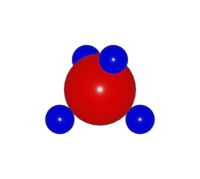
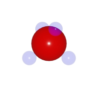
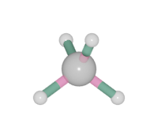

===================
Color setting
===================

Color in ``Blase`` is float array of 4 items in [0, 1]. The four values are represented as: [``Red``, ``Green``, ``Blue``, ``Alpha``]. Transparency is controlled by the ``Alpha`` value.

Batom and Batoms
=====================

The :class:`Batom` object has a ``color`` attribute. One set the ``color`` by:

>>> from ase.build import molecule
>>> from blase.batoms import Batoms
>>> ch4 = molecule('CH4')
>>> ch4 = Batoms(label = 'ch4', atoms = ch4)
>>> ch4.render.run([1, 0.5, 0], engine = 'eevee', resolution_x = 200, output = 'color_ch4_0.png')

.. image:: ../_static/color_ch4_0.png
   :width: 5cm

>>> ch4['H'].color = [0, 0, 0.8, 1.0]
>>> ch4['C'].color = [0.8, 0, 0, 1.0]

Transparency for ``H`` atoms:

>>> ch4['H'].color = [0, 0, 0.8, 0.2]

Bond
===================

One can print the default color by:

>>> ch4.bondsetting['C-H'].color1[:]

One can change color for bond pair ``C-H`` by:

>>> ch4.bondsetting['C-H'].color1 = [0.8, 0.1, 0.3, 0.5]
>>> ch4.bondsetting['C-H'].color2 = [0.1, 0.3, 0.2, 1.0]
>>> ch4.model_type = 1

``color1`` is for the first species in the bond pair (``C``), and ``color2`` is for the second species (``H``).

Polyhedra
================
