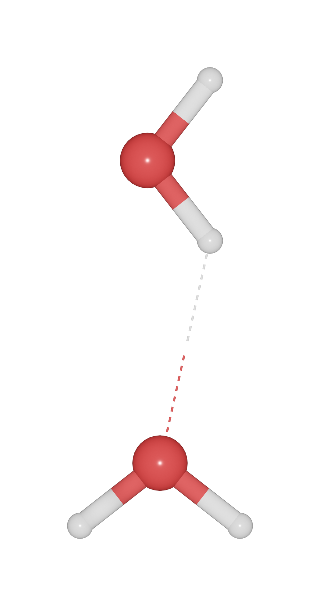

===================
Hydrogen bond
===================

To build up hydrogen bond for ``X-H -- Y``. Set the minimum and maximum distances of ``H-Y``, and set the ``bondlinewdith`` to a small value.

>>> from ase.build import molecule
>>> from blase.batoms import Batoms
>>> h2o = molecule('H2O')
>>> h2o2 = molecule('H2O')
>>> h2o2.rotate(90, 'x')
>>> h2o2.translate([0, 0, 3])
>>> h2o = h2o + h2o2
>>> h2o = Batoms(label = 'h2o', atoms = h2o)
>>> h2o.bondsetting['H-O'].min = 2.0
>>> h2o.bondsetting['H-O'].max = 3.0
>>> h2o.bondsetting['H-O'].bondlinewidth = 0.01
>>> h2o.bondsetting['H-O'].style = '1'
>>> h2o.model_type = 1
>>> h2o.render.run([1, 0 ,0], engine = 'eevee', output = 'hydrogen-bond.png')

