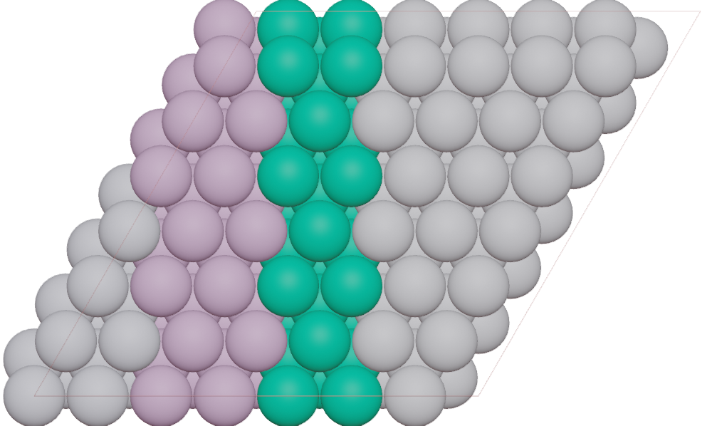

===================
Species
===================

Why we use species instead of element? Because some atoms are special:

* Different color for element.
* Different properties for element, sunch as: spin up and down.
* ghost atoms: vacancy, highlight sphere, cavity
* atoms with different bondsetting

The function ``species`` in :class:`Batom` object is used to specify the symobl of species. We store the ``species`` infomation in ``atoms.info`` for ASE atoms.

>>> from blase.batoms import Batom
>>> h1 = Batom(label = 'h2o', species = 'H_1', element = 'H', positions = [[0, 0, 0]])
>>> h2 = Batom(label = 'h2o', species = 'H_2', element = 'H', positions = [[2, 0, 0]])
>>> h1.scale = 1.0
>>> h2.scale = 2.0

Here we set different color for different platinum atoms:

>>> from ase.build import fcc111
>>> from blase.batoms import Batoms
>>> atoms = fcc111('Pt', (7, 7, 3), vacuum=3.0)
>>> kind_props = {
>>> 'Pt_0': {'color': [0.8, 0.8, 0.9]},
>>> 'Pt_1': {'color': [0.8, 0.5, 0.8]},
>>> 'Pt_2': {'color': [0, 0.7, 0.4]},
>>> }
>>> atoms.info['species'] = []
>>> for i in range(len(atoms)):
>>>     ind = int((atoms[i].x/5))
>>>     kind = atoms[i].symbol + '_{0}'.format(ind)
>>>     atoms.info['species'].append(kind)
>>> pt = Batoms(label = 'pt111', atoms = atoms, kind_props = kind_props)

