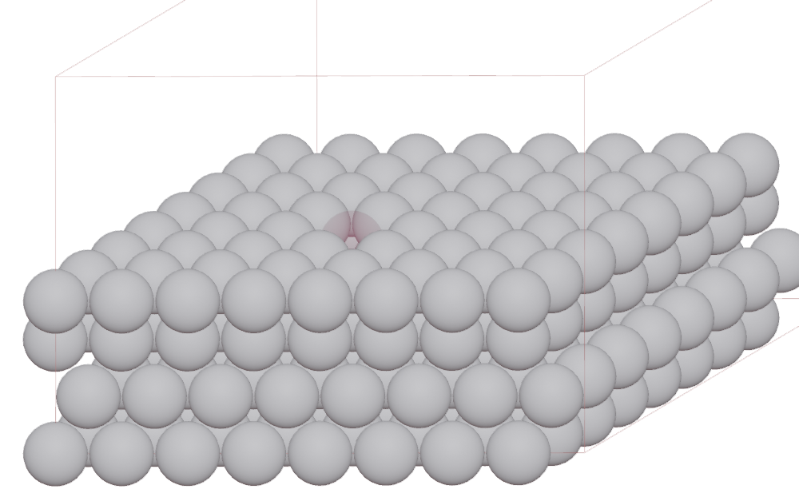

==========================================
Vacancy on surface
==========================================

Build a Pt (111) surface.

>>> from ase.build import fcc111
>>> from blase.batoms import Batoms
>>> atoms = fcc111('Pt', size = (8, 8, 4), vacuum=0)
>>> pt111 = Batoms(label = 'pt111', atoms = atoms)
>>> pt111.cell[2, 2] += 10

Choose the index of the vacancy atom in `Edit` mode. Set the vacancy atom to a new species ``Pt_1``.

>>> pt111.replace('Pt', 'Pt_1', [219])

Then set a different color for ``Pt_1`` species, and make it a little transparent.

>>> pt111['Pt_1'].color = [0.8, 0.1, 0.3, 0.2]

.. note::

    Use ``Cycles`` render engine, and set Principled BSDF node to get a better image.

    .. image:: ../../_static/pt111-vacancy-cycles.png
        :width: 8cm

.. note::

    Above only for visualization, and will not make a real vacancy for your structure. 
    
    To create a real vacancy, please use 

    >>> del pt111['Pt'][[219]]

    

