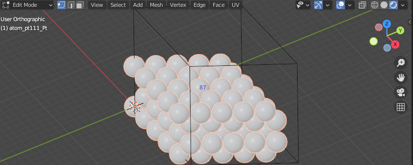
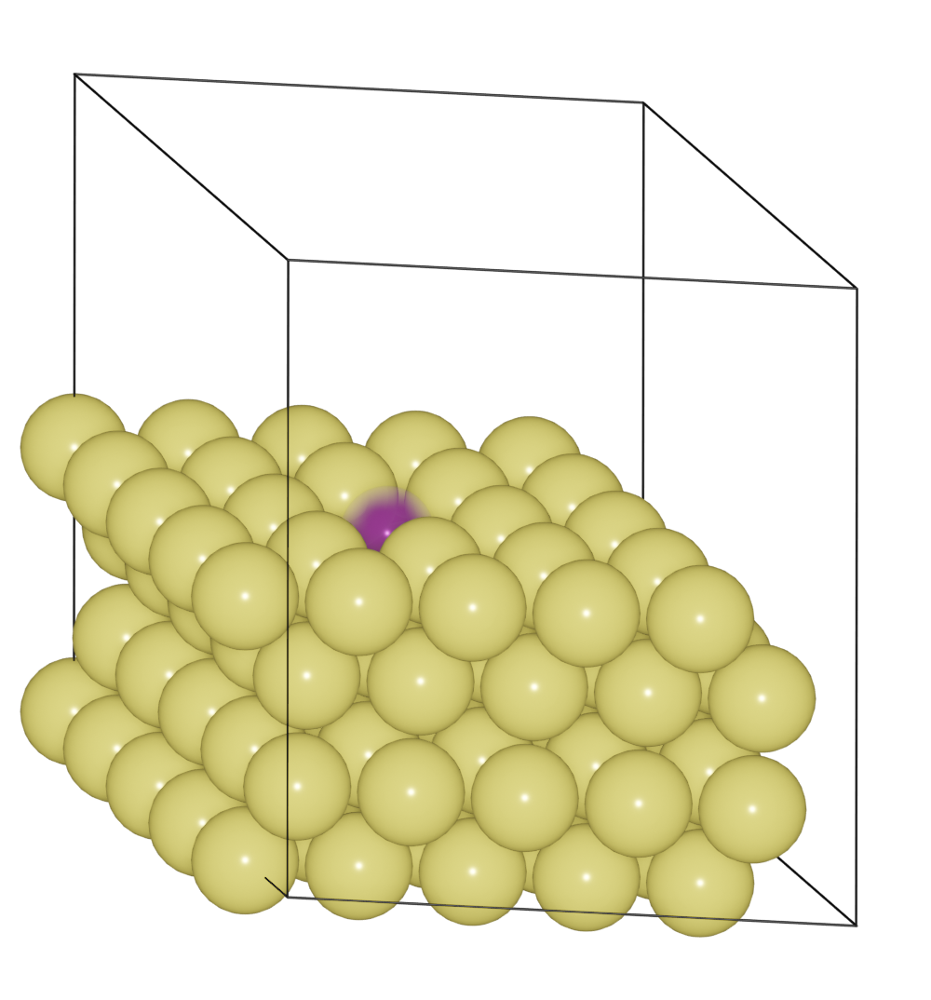

==============================================
Create and visualize vacancy site on surface
==============================================

Build a Au (111) surface.

>>> from ase.build import fcc111
>>> from blase.batoms import Batoms
>>> atoms = fcc111('Au', size = (5, 5, 4), vacuum=0)
>>> au111 = Batoms(label = 'au111', atoms = atoms)
>>> au111.cell[2, 2] += 10
>>> au111.draw_cell()

Select gold atoms, press ``Tab`` key to switch to ``Edit`` mode. Choose the index of atom for the vacancy.

Set the vacancy atom to a ghost species ``X``.

>>> au111.replace('Au', 'X', [87])

Then increase the size and set a different color for ``X`` species, and make it a little transparent.

>>> au111['X'].scale = 6
>>> au111['X'].color = [0.8, 0.0, 0.8, 0.2]

Save structure to file, and renering the image:

>>> au111.write('POSCAR')
>>> au111.render.run([1, -0.4, 0.4], engine = 'eevee', output = 'au111-vacancy.png')

.. note::

    We use ``X`` only for visualization. The ghost species ``X`` will not save to file, thus we make a real vacancy for the surface in the saved file.
    
    Others ways to create a real vacancy is deleting the atom: 

    You can:

    >>> del au111['Au'][87]

    Or in the ``Edit`` mode, selet the atom, press ``X`` key and delete ``vertices``.

.. note::

    Use ``Cycles`` render engine to get a better image.
    
    >>> au111.render.light_energy = 25
    >>> au111.render.run([1, -0.4, 0.4], engine = 'cycles', num_samples = 64, output = 'au111-vacancy-cycles.png')

    .. image:: ../../_static/vacancy-au111-cycles.png
        :width: 12cm

    

