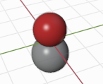
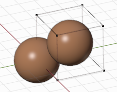

ASE
=================

If you are not familiar with building atomic structure using ASE, please read the following tutorials:

* Building molecule, crystal, surface: https://wiki.fysik.dtu.dk/ase/ase/build/build.html?highlight=build

* Nanoparticles and clusters: https://wiki.fysik.dtu.dk/ase/ase/cluster/cluster.html

* Using the spacegroup to set up crystal structures: https://wiki.fysik.dtu.dk/ase/ase/spacegroup/spacegroup.html?highlight=crystal#ase.spacegroup.crystal

Keyword ``atoms`` in :class:`Batoms` object is uesd to load a ASE_ structure.

Molecule:

>>> from blase.batoms import Batoms
>>> from ase.build import molecule
>>> co = molecule('CO')
>>> co = Batoms(label = 'co', atoms=co)

Crystal:

>>> from blase.batoms import Batoms
>>> from ase.build import bulk
>>> fe = bulk('Fe')
>>> fe = Batoms(label = 'fe', atoms=fe)

